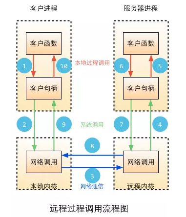

## go rpc

## how to run
## for example
    start server
    go run rpc_server.go
    start client
    go run rpc_client.go 127.0.0.1:1234 20 2
    
    
    
    
   

* 1.调用客户端句柄；执行传送参数
* 2.调用本地系统内核发送网络消息
* 3.消息传送到远程主机
* 4.服务器句柄得到消息并取得参数
* 5.执行远程过程
* 6.执行的过程将结果返回服务器句柄
* 7.服务器句柄返回结果，调用远程系统内核
* 8.消息传回本地主机
* 9.客户句柄由内核接收消息
* 10.客户接收句柄返回的数据

Go语言提供对RPC的支持：HTTP、TCP、JSPNRPC,但是在Go中RPC是独一无二的，它采用了GoLang Gob编码,只能支持Go语言！

GoLang Gob:是Golang包自带的一个数据结构序列化的编码/解码工具。编码使用Encoder，解码使用Decoder。一种典型的应用场景就是RPC(remote procedure calls)。

    
## Go RPC 的函数只有符合四个条件才能够被远程访问，不然会被忽略
* 函数必须是首字母大写（可以导出的）
* 必须有两个导出类型的参数
* 第一个参数是接受的参数，第二个参数是返回给客户端的参数，而且第二个参数是指针的类型
* 函数还要有一个返回值error

    func (t *T) MethodName(argType T1, replyType *T2) error
* T、T1和T2类型必须能被encoding/gob包编解码。

